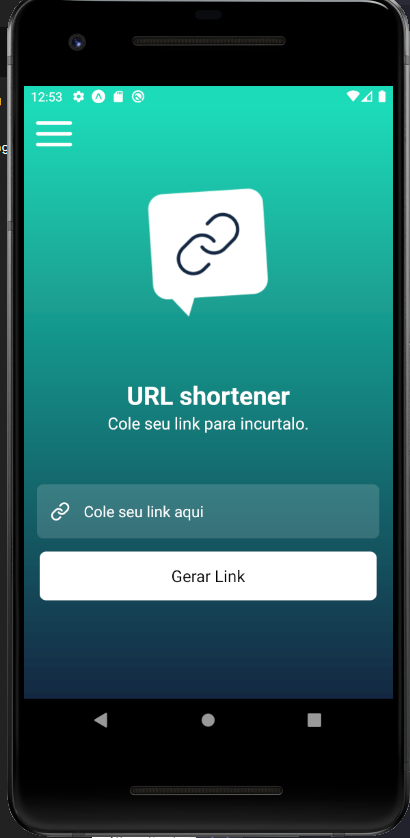

# Encurtador de url

Fiz esse projeto no evento do sujeito programador consumindo a api do bitlink, e meu primeiro contato com expo antes só tinha feito com o cli, gostei muito, pois, traz uma facilidade muito grande.

https://www.youtube.com/channel/UCLc5Bq2yfs-S3Zse3ZFRMEQ

Nesse projeto as únicas adições que fiz foi tema global e o uso de Context Api.

